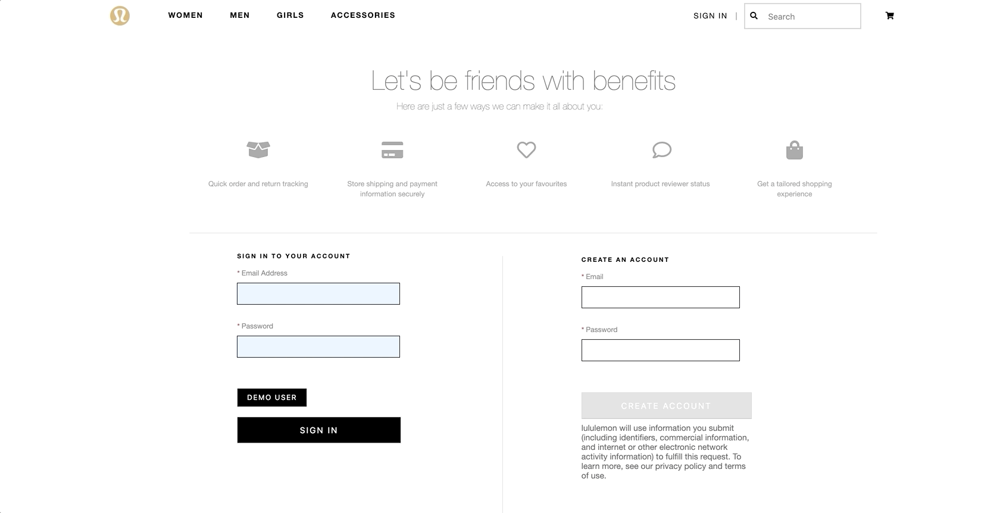
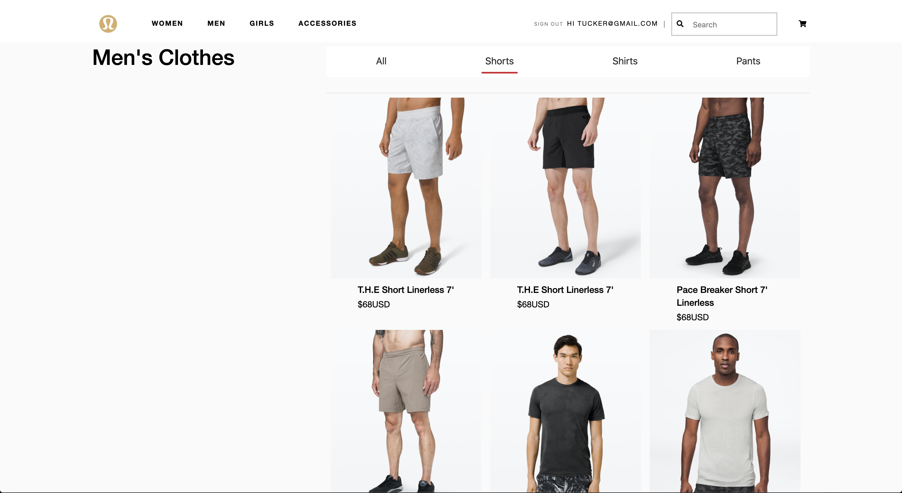

# Luiluilemon

[Live Site](https://luiluilemon.herokuapp.com/#/)

Luiluilemon is an e-commerce website inspired by Lululemon, a fitness apparel company. 


## Technologies

### Backend
  * Ruby on Rails
  * Postgresql
### Frontend
  * React
  * Redux
### Other
  * AWS
  * Heroku

## Features 

### User Authentication
  * Secure User Auth created using BCrypt hasing
  * Users are able to create an account, login, and logout of an account 
  
```
    def self.find_by_credentials(email, password)
        user = User.find_by(email: email)
        return nil if user.nil?
        user.is_password?(password) ? user : nil
    end

    def password=(password)
        @password = password
        self.password_digest = BCrypt::Password.create(password)    
    end

    def is_password?(password)
        BCrypt::Password.new(self.password_digest).is_password?(password)
    end

    def reset_session_token!
        self.session_token = SecureRandom.urlsafe_base64(16)
        self.save!
        self.session_token
    end
```
  * Demo account available
  


### Product Index 


  * Allow users to view all products or filter out by type
     
```
    def index
        if params[:itemtype]
            @products = Product.where(itemtype: params[:itemtype])
        else
            @products = Product.all
        end
        render :index
    end
```

### Cart


 * Displays all user cart items
 * Price and quantity are updated as items are added or removed
 * Clicking on product image will redirect user back to product show page
 

